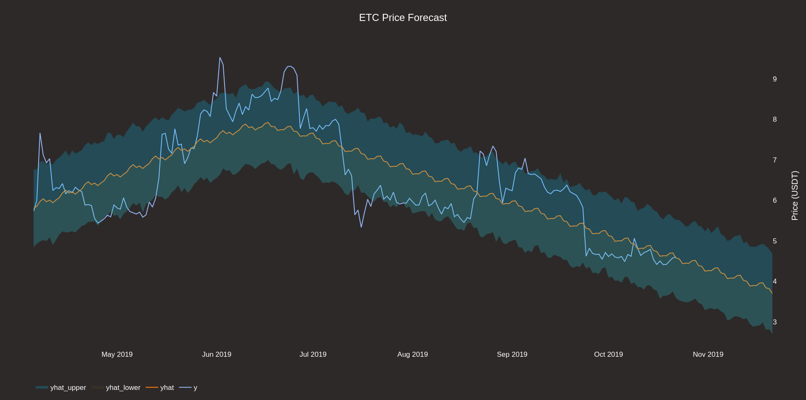
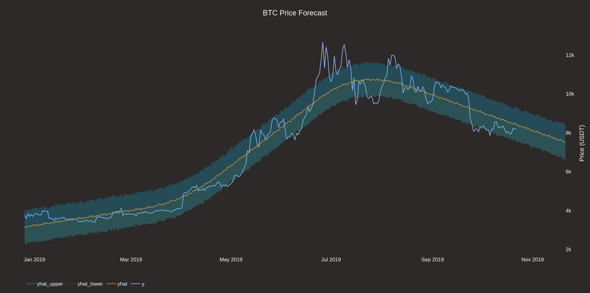
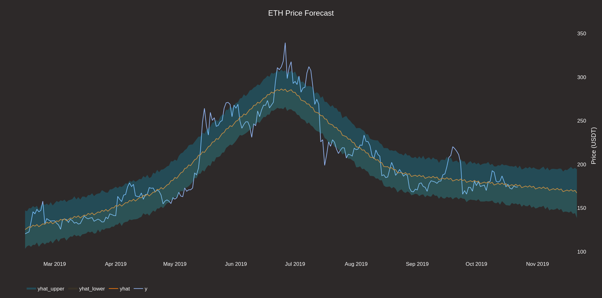

# Nostradamus Price Forecaster

[](https://app.codacy.com/app/Draichi/cryptocurrency_prediction?utm_source=github.com&utm_medium=referral&utm_content=Draichi/cryptocurrency_prediction&utm_campaign=Badge_Grade_Dashboard)

Nonlinear and linear regression model implementation [(paper)](https://peerj.com/preprints/3190.pdf) that generate adaptative cryptocurrencys price forecasts

<a href="https://plot.ly/~EnricoFermi/3.embed"></a>
<a href="https://plot.ly/~EnricoFermi/5.embed"></a>
<a href="https://plot.ly/~EnricoFermi/7.embed"></a>

## Setup

You must get your free api key from cryptocompare.com and miniconda installed

```sh
cp .env.example .env
# Paste your cyptocompare api key on .env

conda env create -f environment.yml

conda activate nostradamus
```

## Running

```sh
python example_script.py
```

---

<div style="text-align:center">
  
</div>
