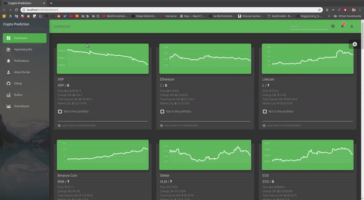
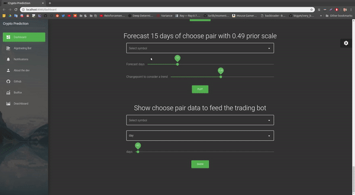

# Cryptocurrency prediction


[](https://app.codacy.com/app/Draichi/cryptocurrency_prediction?utm_source=github.com&utm_medium=referral&utm_content=Draichi/cryptocurrency_prediction&utm_campaign=Badge_Grade_Dashboard)

Deep tecnical analysis of cryptocurrencies with reinforcement learning

<div style="text-align:center">
  
</div>

## Live

<!-- -   [Rolling Correlation](https://draichi.github.io/cryptocurrency_prediction/rolling_corr_DASH_2019-04-16.html) -->
-   [Spearman Correlation](https://draichi.github.io/crypto_dashboard/correlation_spearman_2019-04-12.html)
-   [Portfolio Returns](https://draichi.github.io/crypto_dashboard/returns_2019-04-12.html)
-   [Prophet EOS](https://draichi.github.io/crypto_dashboard/prophet_2019-04-12_EOS.html)
-   [Prophet ETH](https://draichi.github.io/crypto_dashboard/prophet_2019-04-12_ETH.html)
-   [Prophet LTC](https://draichi.github.io/crypto_dashboard/prophet_2019-04-12_LTC.html)
<!-- -   [Weights per asset at different expected returns (%)](https://draichi.github.io/cryptocurrency_prediction/weights_2019-04-16.html) -->
<!-- -   [Risk associated with different levels of returns](https://draichi.github.io/cryptocurrency_prediction/efficient_frontier_2019-04-16.html) -->

<div style="text-align:center">
  
</div>

## Prerequisites

-   [Miniconda](https://conda.io/docs/user-guide/install/index.html) or Anaconda
-   [Node](https://nodejs.org/en/)

## Setup

>To use the portfolio funcions you must initiate the server :

### Ubuntu

```sh
sudo apt-get install gcc g++ build-essential python-dev python3-dev htop
# make sure you have these installed
conda env create -f UBUNTU_CPU.yml
# create env
conda activate crypto_prediction
# activate it
python server.py
# init server at localhost:3030
```

### Windows

```sh
# make sure you have a recent C++ compiler
conda env create -f WINDOWS_CPU.yml
# create env
conda activate crypto_prediction
# activate it
python server.py
# init server at localhost:3030
```

### Mac

```sh
conda env create -f MAC_CPU.yml
# create env
conda activate crypto_prediction
# activate it
python server.py
# init server at localhost:3030
```

>You can use the online [dashboard](https://draichi.github.io/cryptocurrency_prediction/index.html) or initiate yours:


```sh
yarn
# or `npm i`
yarn serve
# or `npm run dev`
```

* * *


## Credits

-   [Papers](https://github.com/Draichi/Portfolio-Management-list/blob/master/README.md)
-   [Analyzing cryptocurrency markets using python](https://blog.patricktriest.com/analyzing-cryptocurrencies-python/)

* * *

<div style="text-align:center">
  
</div>